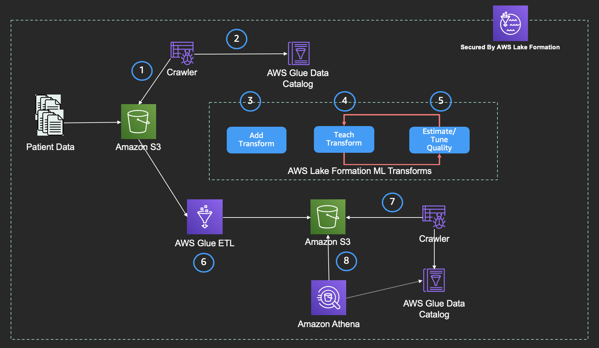

## Workshop - Using AWS Lake Formation ML Transforms to cleanse the data in a data lake

### Background
Customers ingest data from multiple sources into their data lakes. This data often has the same meaning but uses different labels/names, which can take months to cleanse, slowing down the data processing and analytics cycle.

### Introduction
In this lab, participants will go through various steps to provision a data lake, catalog data in AWS Glue Data Catalog and use AWS Lake Formation ML Transforms to cleanse the data in a data lake.

### Lab Data Set
We have used the synthetic dataset generated from Open Source Freely extensible Biomedical Record Linkage Program (FEBRL). This dataset mimicks real-life patient data sets that lead to duplicates. You can also generate the dataset by following the steps mentioned @ https://github.com/J535D165/FEBRL-fork-v0.4.2/tree/master/dsgen. For the sake of simplicity, we would be copying the dataset automatically into an Amazon S3 bucket that is created as part of the CloudFormation launch.

### Architecture
Below is the high-level architecture that you would be implementing as part of this lab.

### Activities
Below table summarizes various activities to be done as part of creating a data lake and using AWS Lake Formation ML Transforms to deduplicate the data in a data lake.

| No. | Activity  | User |
| --- | ------------- | ------------- |
| 1 | Content Cell  | Content Cell  |
| 2| Content Cell  | Content Cell  |

TODO: Fill this README out!

Be sure to:

* Change the title in this README
* Edit your repository description on GitHub

## License

This library is licensed under the MIT-0 License. See the LICENSE file.

